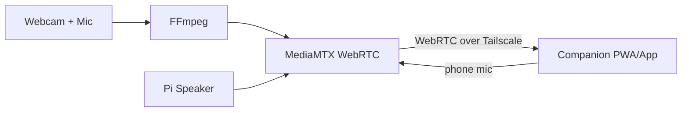

# Cat Cam — Raspberry Pi Surveillance Setup Guide

A two-way audio/video monitor for keeping an eye (and ear) on the cat, viewable
from your phone. Live video, hear the flat, and talk to the cat — with secure
remote access and room to add motion alerts later.

---

## 1. Project Overview

**Goal:** One webcam streaming live video + audio to your phone, plus two-way
talk so you can speak to the cat and hear noises in the flat. Live viewing first;
motion alerts as a later add-on.

**Chosen stack:**

| Component   | Role                                                                 |
|-------------|----------------------------------------------------------------------|
| MediaMTX    | WebRTC streaming server — serves a browser page, handles 2-way audio |
| FFmpeg      | Captures webcam video + mic audio, feeds it to MediaMTX              |
| Tailscale   | Secure remote phone access (no port forwarding)                      |
| OpenCV + ntfy | *(Later)* motion detection + push alerts to phone                  |

**Why WebRTC / MediaMTX:** browsers natively support sending the phone's mic
*back* to the Pi speaker, so two-way talk works with no custom app — just a
browser tab. Low latency, and a built-in publish/view web page.

---

## 2. Hardware

### Already have
- Raspberry Pi 5, 8GB
- 64GB microSD card

### Still to buy
- [ ] **USB webcam with built-in mic** — confirm it's **UVC-compatible** (most
      are) so Linux detects it without drivers. Check reviews mention Linux/`v4l2`.
- [ ] **Speaker** — a **USB speaker** is the least painful option (shows up as
      its own audio device). Alternatively a small amp + speaker, or a USB DAC.
- [ ] **Official Pi 5 power supply** — undervoltage causes camera/USB dropouts.
- [ ] **Case** (optional) and a small **tripod or mount** to aim at the cat's
      favourite spot.

### Nice to have
- Small heatsink/fan for the Pi 5 (video encoding generates heat).

---

## 3. Phase 1 — Base OS + Verify Devices

Get the OS ready and confirm every device is detected **before** touching
streaming. This saves hours of debugging later.

### 3.1 Flash and boot
1. Flash **Raspberry Pi OS (Lite, 64-bit)** with Raspberry Pi Imager.
2. In the Imager settings, pre-configure: hostname, **enable SSH**, Wi-Fi
   credentials, and your locale.
3. Boot the Pi headless and SSH in:
   ```bash
   ssh <user>@<pi-hostname>.local
   ```
4. Update:
   ```bash
   sudo apt update && sudo apt full-upgrade -y
   sudo apt install -y ffmpeg v4l-utils alsa-utils fswebcam
   ```

### 3.2 Verify the devices
```bash
# Video device — note the /dev/videoN path
v4l2-ctl --list-devices

# Audio capture (mic) — note the card,device numbers e.g. card 2, device 0
arecord -l

# Audio playback (speaker) — note the card,device numbers
aplay -l
```

### 3.3 Quick round-trip tests
```bash
fswebcam test.jpg                                 # video capture works?
arecord -d 5 -f cd test.wav && aplay test.wav     # mic + speaker round-trip
speaker-test -t wav -c 2                           # speaker only
```

> **Write down** the device addresses now, you'll need them for FFmpeg:
> - Video: `/dev/video____`
> - Mic (capture): `hw:____,____`
> - Speaker (playback): `hw:____,____`

---

## 4. Phase 2 — Install & Run MediaMTX

```bash
# Get the latest ARM64 (arm64v8) release from:
# https://github.com/bluenviron/mediamtx/releases
wget https://github.com/bluenviron/mediamtx/releases/latest/download/mediamtx_linux_arm64v8.tar.gz
tar -xzf mediamtx_*.tar.gz
./mediamtx
```

- MediaMTX serves a WebRTC page at `http://<pi-ip>:8889/cam` once something is
  publishing to a path named `cam`.
- Leave it running in one terminal for now; we'll make it a service later.

---

## 5. Phase 3 — Publish Camera + Mic

Configure MediaMTX to auto-launch FFmpeg. Edit `mediamtx.yml`:

```yaml
paths:
  cam:
    runOnInit: >
      ffmpeg -f v4l2 -framerate 30 -video_size 1280x720 -i /dev/video0
      -f alsa -i hw:2,0
      -c:v libx264 -preset ultrafast -tune zerolatency -pix_fmt yuv420p
      -c:a libopus -b:a 64k
      -f rtsp rtsp://localhost:8554/cam
    runOnInitRestart: yes
```

- Replace `/dev/video0` and `hw:2,0` with the values from Phase 1.
- Restart MediaMTX, then on your phone (same Wi-Fi) open:
  `http://<pi-ip>:8889/cam`
- You should see **live video** and hear the **flat's audio**.

**Tuning tips:**
- Drop to `640x480` or `15` fps if the stream stutters.
- `ultrafast` + `zerolatency` keeps latency low at the cost of file size (fine
  for live streaming).

---

## 6. Phase 4 — Two-Way Talk (Speaker Out)

1. On your phone, open the publisher page: `http://<pi-ip>:8889/cam/publish`
   and **enable the microphone** — this streams your phone's mic *to* the Pi.
2. On the Pi, run a reader that pulls that incoming audio stream and routes it
   to the speaker (exact command depends on your speaker's `hw:` address —
   tune once hardware is in hand). General shape:
   ```bash
   ffmpeg -i rtsp://localhost:8554/cam -f alsa hw:X,Y
   ```
3. Result: speak on the phone → cat hears you through the Pi speaker.

> This phase usually needs a little trial and error with device routing and
> echo. Get one-way audio solid first, then enable the return path.

---

## 7. Phase 5 — Secure Remote Access (Tailscale)

**Do not** port-forward the Pi to the internet. Use a VPN mesh instead:

```bash
curl -fsSL https://tailscale.com/install.sh | sh
sudo tailscale up
```

- Install the **Tailscale app on your phone** and sign in with the same account.
- Access from anywhere, encrypted:
  `http://<pi-tailscale-ip>:8889/cam`

---

## 8. Security

This is a camera **and microphone inside your home** with remote access and a
two-way audio path into the speaker — treat it accordingly. The chosen stack is
secure by design; the rest is configuration and discipline. Work top-down:
network exposure is the biggest risk.

### 8.1 Network exposure (highest priority)
- **Never port-forward the Pi or expose it directly to the internet.**
  Public-facing cameras are constantly scanned and are the #1 breach vector.
- **Tailscale is the main defence** — the Pi sits on a private encrypted mesh;
  only your logged-in devices can reach it. No open ports, nothing publicly
  discoverable. Keep access Tailscale-only.
- Avoid UPnP / port-forward tutorials — they trade privacy for convenience.
- Optionally use **Tailscale ACLs** to restrict which devices can reach the Pi.

### 8.2 Host hardening (the Pi)
- **No default logins** — strong, unique password; never leave `pi`/`raspberry`.
- **SSH keys, not passwords** — generate a key, then disable password auth and
  root login in `/etc/ssh/sshd_config`.
- **Patch regularly** — `sudo apt update && sudo apt full-upgrade`; consider
  `unattended-upgrades` for automatic security updates.
- **Firewall** — `ufw` allowing only SSH + the Tailscale interface; deny the
  rest inbound.
- **Minimal software** — Pi OS Lite already keeps the attack surface small.

### 8.3 Stream & MediaMTX
- **Authentication** — set per-path credentials in `mediamtx.yml` for both
  viewing *and* publishing, so nobody on the network can silently open the feed.
- **Encryption** — WebRTC media is encrypted (DTLS-SRTP) by default. Enable
  **HTTPS/TLS** for the web/signaling layer, or rely on Tailscale's encryption
  if access is Tailscale-only.
- **Lock down the publish endpoint especially** — that's the path into your
  speaker.

### 8.4 Two-way audio (extra caution)
The return audio path lets a remote party **transmit into your home**, so:
- Require authentication on the publish path (above).
- Keep it reachable only over Tailscale.
- Consider a **push-to-talk** toggle so the mic path is active only when you
  deliberately use it.

### 8.5 Companion app / PWA
- Serve it over **HTTPS only**.
- **Never hardcode credentials in client-side JS** — anyone can read it. Use
  MediaMTX's auth flow, or keep the whole thing behind Tailscale so the network
  is the auth boundary.
- If you add ntfy alerts later, use a **private/random topic name** — public
  ntfy topics are readable by anyone who knows the name.

### 8.6 Physical & privacy
- Aim the camera at only what you need (the cat's spots), not the whole flat or
  neighbours' windows.
- A lens shutter/tape or a power switch is a reasonable habit for when you're
  home.
- Keep any future recordings **local** (Pi/SD), not third-party cloud, unless
  it's trusted and encrypted.

### 8.7 Priority order
1. Tailscale-only access, **zero port forwarding**.
2. SSH keys + strong password + firewall.
3. MediaMTX authentication, especially the **publish (talk)** path.
4. HTTPS/TLS for the web/app layer.
5. Keep everything patched.

---

## 9. Companion App

> **Target platform: Android.** This simplifies things — Android has full PWA
> support including background **push notifications** (unlike iOS), so a PWA can
> cover live view *and* future alerts without going native.

"Accessing the camera" over the network is already solved by MediaMTX/WebRTC —
a companion app is really about wrapping that stream in a nicer, purpose-built
interface (live view, a big **Talk to cat** button, fullscreen, later: alerts)
instead of typing a URL into a browser.

### 9.1 Options (least → most effort)

| Option | What it is | Pros | Cons | Effort |
|--------|------------|------|------|--------|
| **A. PWA** ⭐ | Installable web app (home-screen icon, fullscreen) | Reuses existing WebRTC, no app store, **background push works on Android**, installs via Chrome | Not in the Play Store (side-installs from browser) | Low |
| **B. TWA / Native + WebView** | Wrap the PWA in a **Trusted Web Activity** (or React Native / Kotlin shell) for a real Play Store app | Play Store listing, native splash/icon, same web code | Play Console account + signing setup | Medium |
| **C. Fully native (Kotlin) WebRTC** | Consume WebRTC/RTSP with native Android SDKs | Best performance & control | Most WebRTC plumbing, overkill for one camera | High |

### 9.2 Recommendation
Start with a **PWA (Option A)** — on Android it gives a real "app" feel
(installable icon, custom two-way-talk button, live view, and background push for
alerts) while reusing 100% of the existing stack. If you later want a proper
**Play Store** presence, wrap the same PWA in a **Trusted Web Activity (TWA)**
via Bubblewrap (Option B) — no rewrite needed.

### 9.3 PWA build steps
1. **Page** — a small HTML/JS page that embeds the MediaMTX WebRTC stream
   (point it at `http://<pi-tailscale-ip>:8889/cam`). Add your own controls:
   view, mute, fullscreen, push-to-talk.
2. **Manifest** — add a `manifest.json` (app name, icons, `display: standalone`)
   so it installs to the home screen.
3. **Service worker** — register a minimal service worker to make it installable
   and cache the shell (not the live stream).
4. **Serve over HTTPS** — required for PWAs and for the phone mic (getUserMedia).
   Serve it from the Pi (MediaMTX/a small web server) or any host reachable over
   Tailscale.
5. **Install** — open it in **Chrome on Android** → "Add to Home Screen" /
   "Install app" → launches fullscreen like a native app.

### 9.4 Architecture



> The app only needs to reach the Pi's **Tailscale IP**, so remote access keeps
> working anywhere without exposing the Pi publicly. Follow the Security section
> — HTTPS only, no hardcoded credentials in client-side JS.

### 9.5 "Being viewed" audible indicator

The Pi should make a noise whenever the camera is being watched, so anyone in the
flat knows the feed is live. MediaMTX has a per-path **`runOnRead`** hook that
fires the moment a client starts reading the stream, and **`runOnUnread`** when
they stop — perfect for playing a chime through the Pi speaker.

Add to the `cam` path in `mediamtx.yml`:

```yaml
paths:
  cam:
    # ... existing runOnInit / runOnInitRestart ...
    runOnRead: aplay /home/<user>/cat-cam/viewing-start.wav
    runOnUnread: aplay /home/<user>/cat-cam/viewing-stop.wav
```

Notes:
- Put a short `.wav` chime at those paths (or generate one with
  `speaker-test` / `ffmpeg`). Keep it brief so it doesn't fight the two-way audio.
- `runOnRead` runs **once per viewer session**. If you only ever have one viewer
  (you), it effectively means "someone opened the app."
- If the speaker is on a specific ALSA device, target it explicitly, e.g.
  `aplay -D hw:X,Y /home/<user>/cat-cam/viewing-start.wav`.
- Optional: have the same hook also send a phone push via `ntfy` so you get a
  "camera opened" notification as well as the in-room chime.

> Consider whether you want the chime for *every* connect. Because it plays on
> the shared speaker, it doubles as a privacy signal to anyone in the flat —
> which is a nice, honest default for an always-available camera.

---

## 10. Phase 6 — Alerts (Later)

Once live viewing is rock-solid, add motion detection without disturbing the
streaming layer:

1. A small **Python + OpenCV** script reads the same RTSP stream
   (`rtsp://localhost:8554/cam`), compares consecutive frames, and detects
   motion above a threshold.
2. On motion, push a phone notification via **[ntfy.sh](https://ntfy.sh)** —
   dead simple, just an HTTP POST to a topic your phone subscribes to.

---

## 11. Make It Permanent (Recommended once working)

- Turn MediaMTX into a **systemd service** so it starts on boot and restarts on
  failure.
- Keep `mediamtx.yml` and any scripts in a git repo so config is versioned.

---

## 12. Build Order Checklist

- [ ] **Phase 1** — OS installed, SSH works, all 3 devices detected, `hw:`
      addresses recorded.
- [ ] **Phase 2** — MediaMTX running and reachable on local Wi-Fi.
- [ ] **Phase 3** — Live video + mic audio on phone browser.
- [ ] **Phase 4** — Two-way talk working.
- [ ] **Phase 5** — Tailscale remote access.
- [ ] **Security** — Tailscale-only, SSH keys, firewall, MediaMTX auth, HTTPS.
- [ ] **Companion app** — PWA with live view + push-to-talk, served over HTTPS.
- [ ] **Viewing indicator** — Pi plays a chime via `runOnRead` when watched.
- [ ] **Phase 6** — Motion alerts.
- [ ] **Hardening** — systemd service, config in git.

---

## 13. Handy References

- MediaMTX: https://github.com/bluenviron/mediamtx
- FFmpeg V4L2/ALSA capture: https://trac.ffmpeg.org/wiki/Capture/Webcam
- Tailscale: https://tailscale.com/download
- ntfy push notifications: https://ntfy.sh

---

*Guide created 2026-07-28. Update the `hw:` / `/dev/video*` placeholders once the
webcam and speaker arrive.*
